# 常用命令

cd 改变目录
cd.. 退回上一个目录
pwd 显示当前所在的目录路径
mkdir 新建一个目录
~表示主目录

---

cp复制
mv 移动文件
ls（ll）列出当前目录中的所有文件
tough 新建一个文件
rm 删除一个文件
rm -r 删除一个文件夹

---

reset 重新初始化终端
clear 清屏
history 查看
help 帮助
exit 退出
\# 表示注释

---

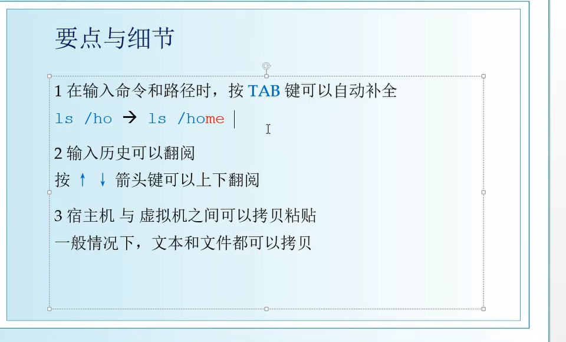

---

-l参数表示详细
-p参数可以用于创建多级目录
-rf参数可以用于强制删除，例如：rm -rf表示删除该目录及其子目录

---
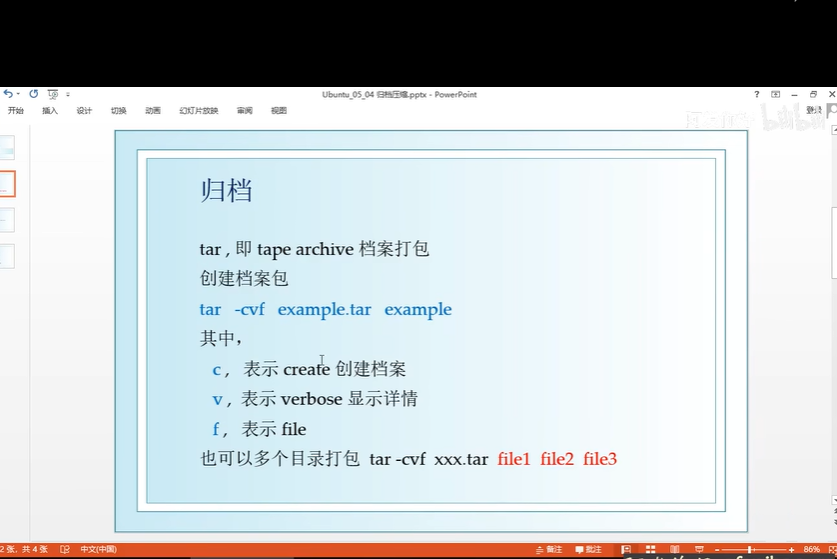
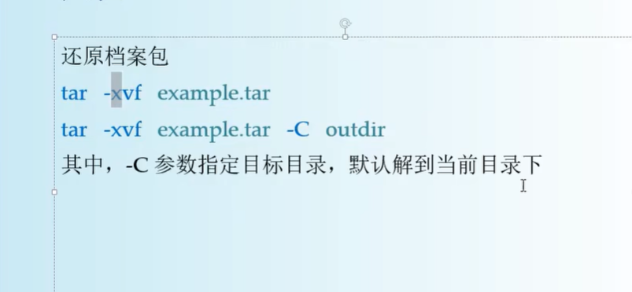
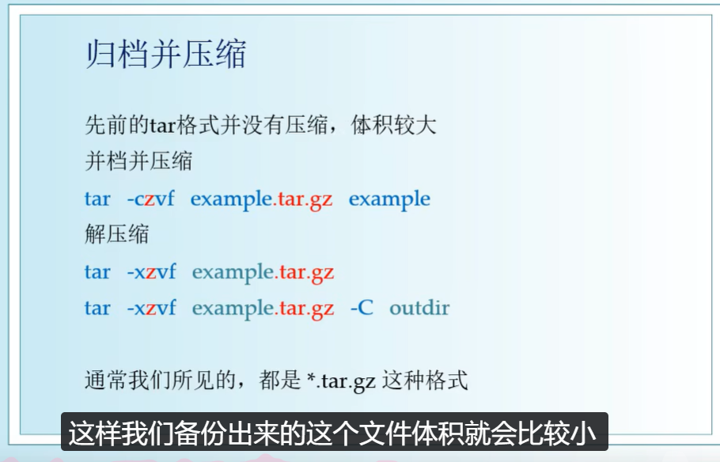

---

软连接：即快捷方式
命令行：ln -s source link
其中-s表示soft

---
# 虚拟机
- 挂起：可以冻结当前状态，方便下次打开使用
- 修改设置前要先关机
- 快照与系统恢复：拍摄快照存储系统当前状态
- Ubuntu没有c盘d盘;/表示根目录，其后为一级子目录，每个目录都从/开始
---
- home下为各个用户的目录
- root是超级用户的目录
- 对于普通用户，它只能操作自己用户目录下的文件
- sudo表示以管理员身份运行（sudo加在命令行前面可以解锁管理员权限，比如可以创建用户）
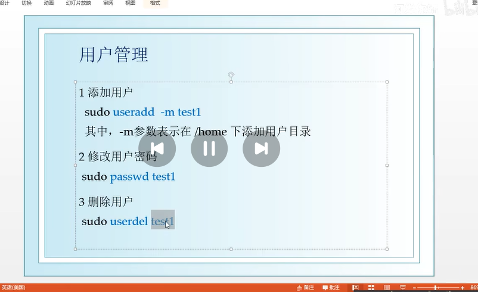
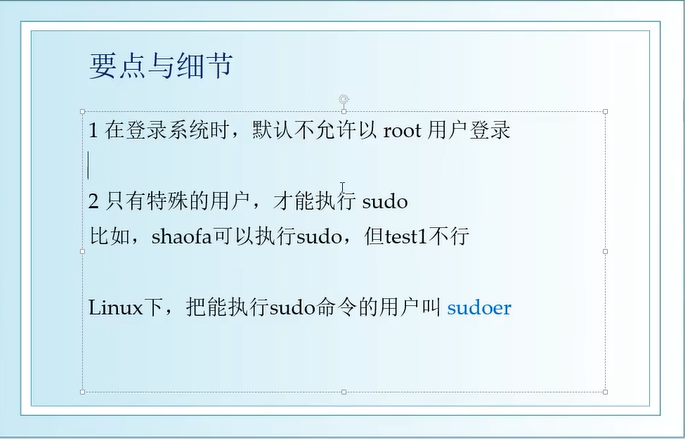
- 超级用户：
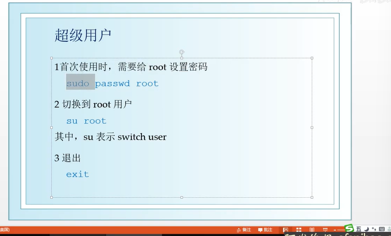
- 用户组
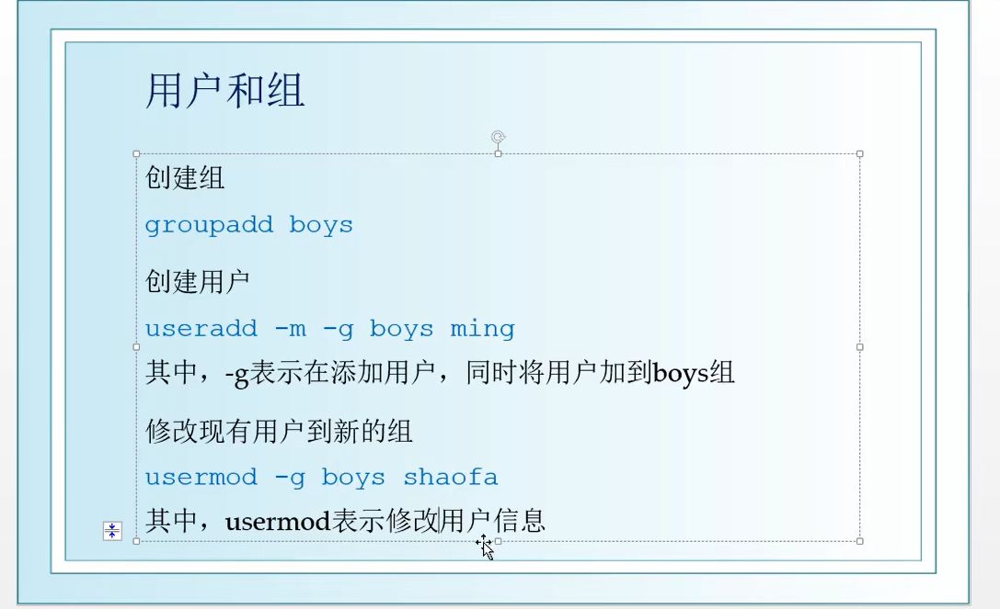
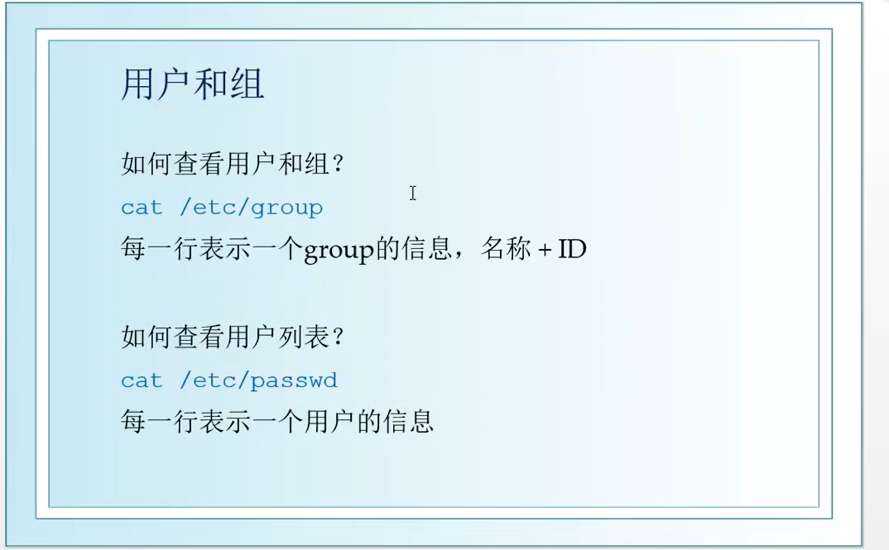
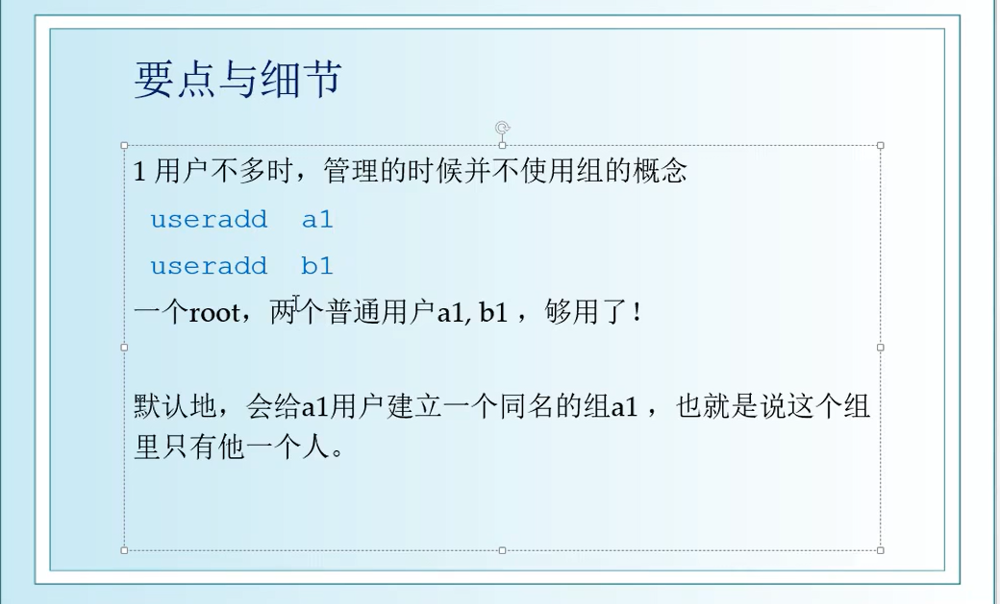

---
- 文件权限
ls -l可以查看文件权限
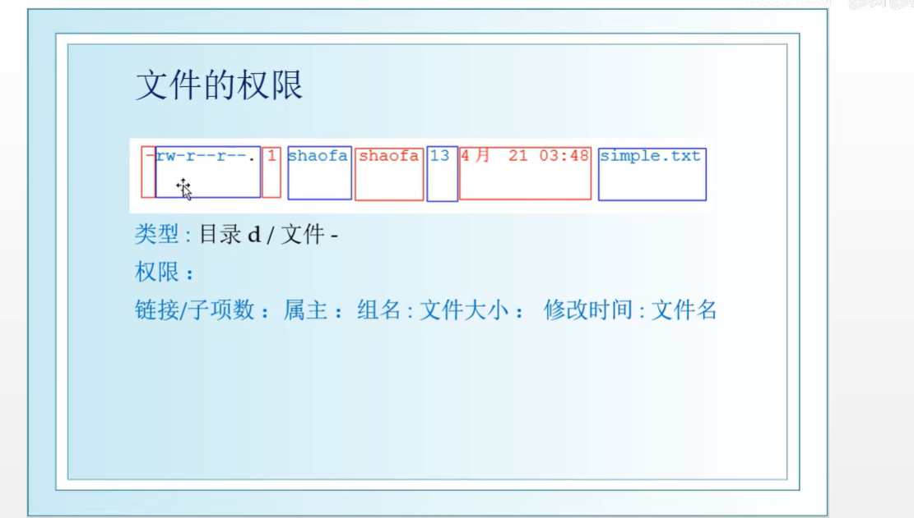
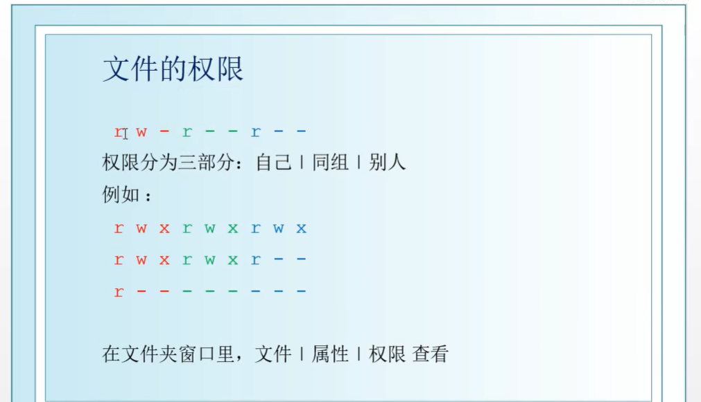
注：x表示可执行
- 修改文件权限
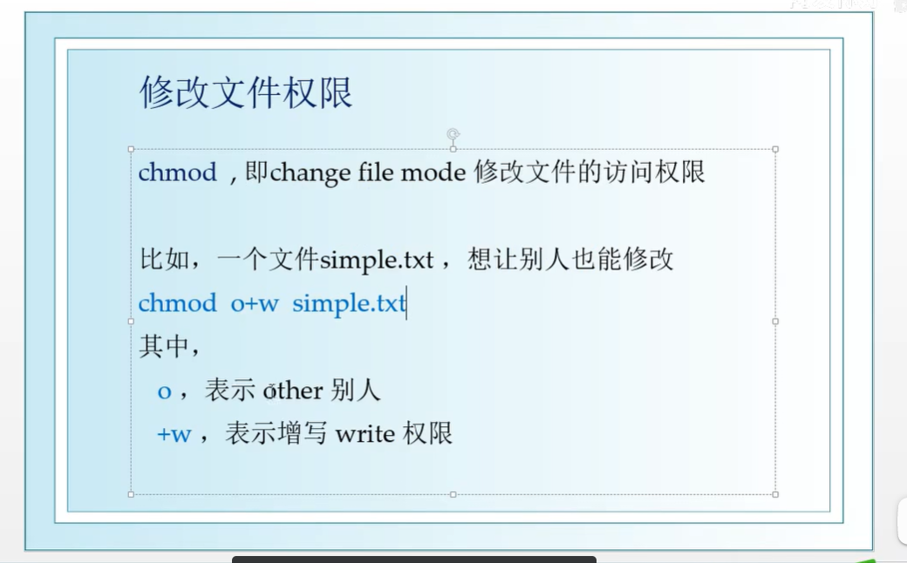
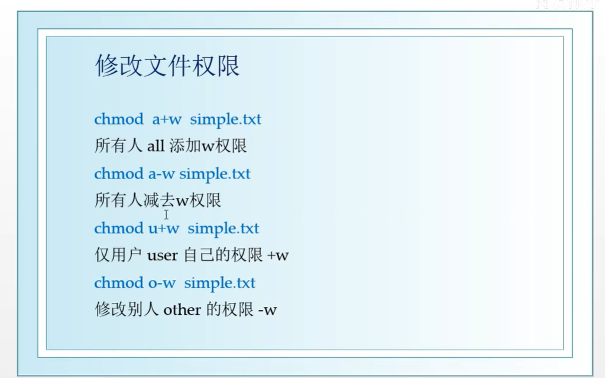
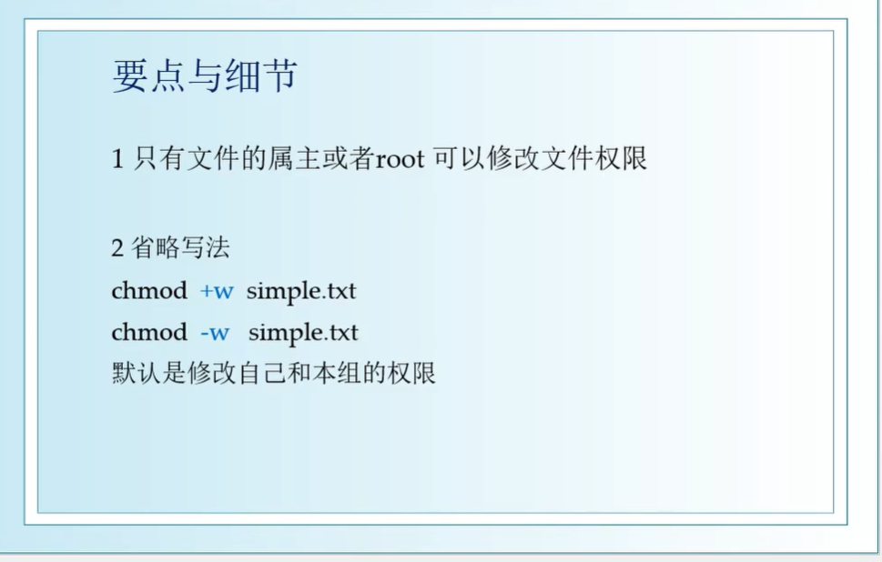
- 修改文件属主(不常用，需要文件作者或root权限)
chown(change owner)

---
- 可执行脚本(也就是不通过编译就可以执行，本质上是一个文本文件)
主要有三种：shell(*.sh)
           Perl(8.pl)
           Python(*.py)

---

- 环境变量
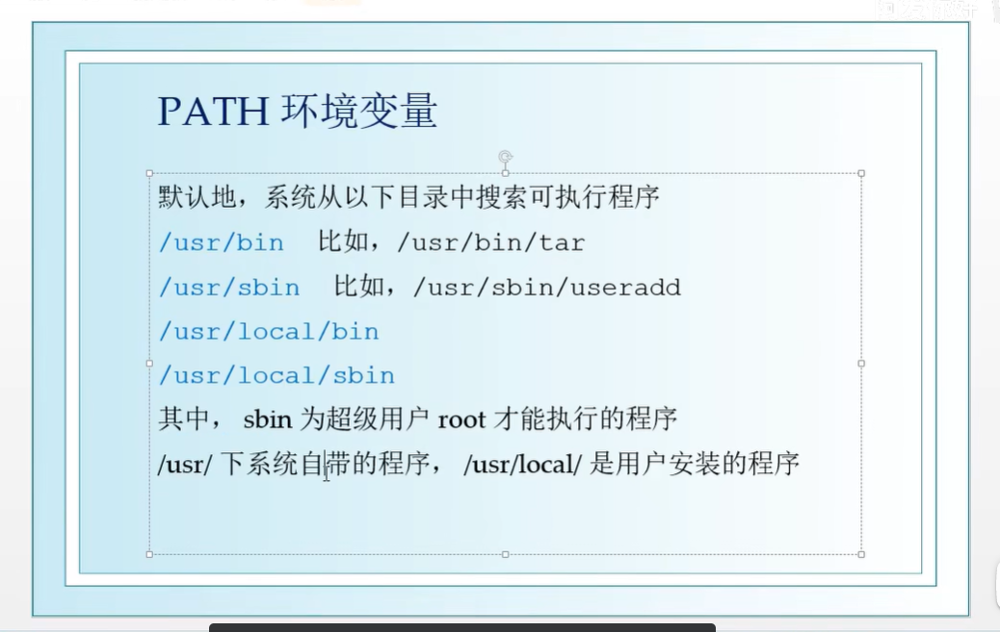
- 虚拟机联网
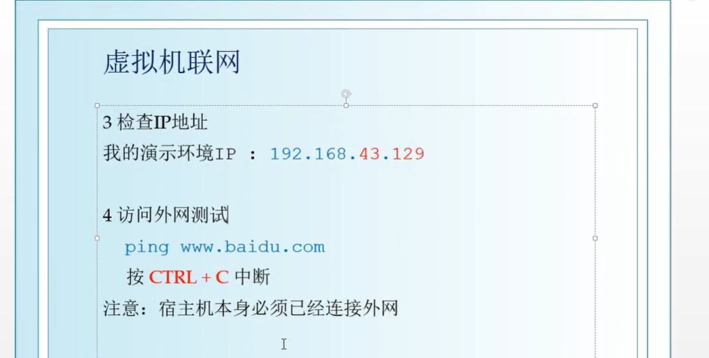
ping是一个常用的操作，用来检查网络是否连接
- 与宿主机互联
通过IP地址互联
- 手动配置网络
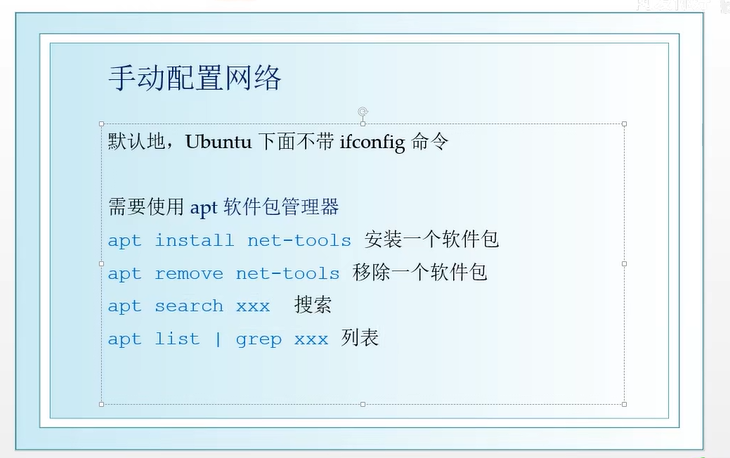

---

- FTP服务器
目的：在Ubuntu上传递文件
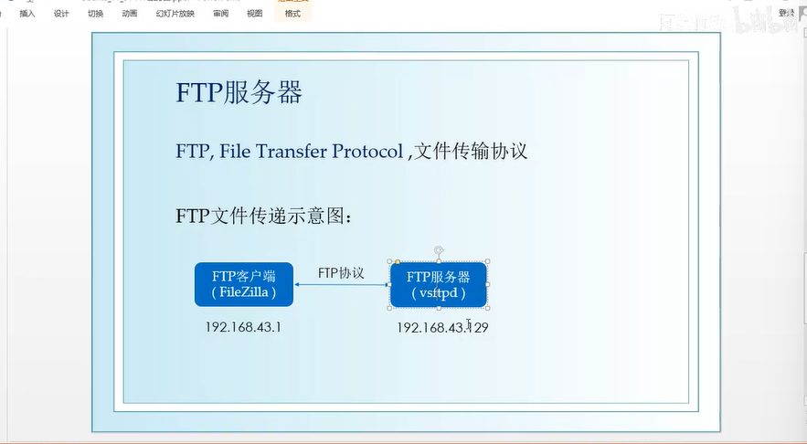
